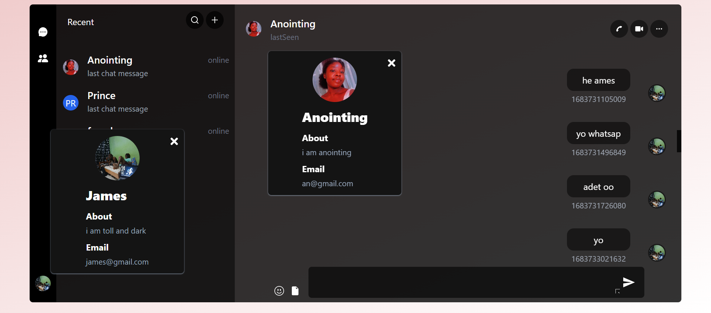
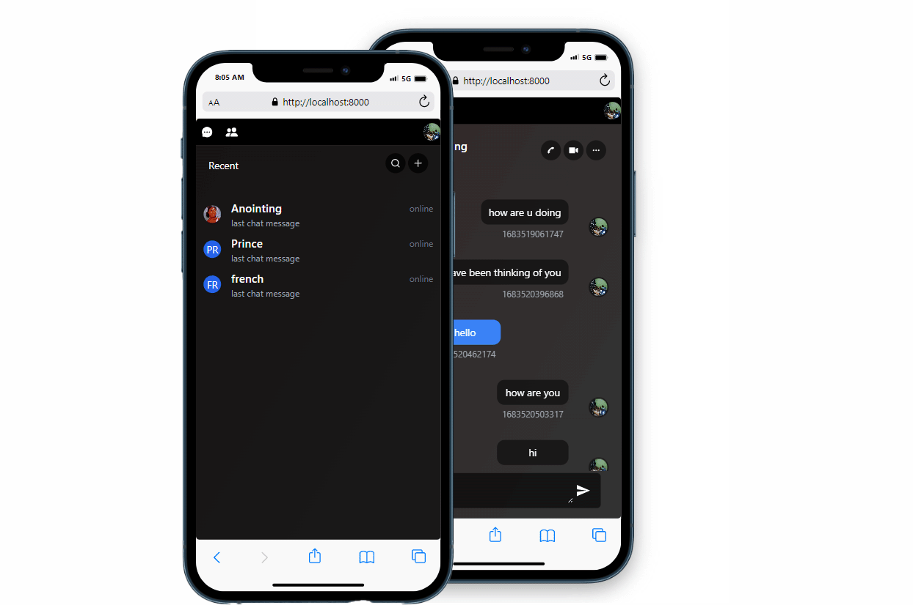

# Minimalist chat application

This application is composed of various technologies. They are as follows

- React
- Tailwind css
- zustand
- Nodejs
- Express
- Mongoose
- Passport authentication
- Restful Api
- Mongodb
- Socket.io
- Graphql
- apollo server - apollo client
- With other technologies that are not listed here.

## Simple Chat page with easy and friendly to use UI

You are able to see your recent chats, add new friends, send friend requests to
users on the application. It comes with full authentication system the utilizes passport authentications. Made with the user in mind.

### Desktop responsive UI

### Mobile responsive UI

